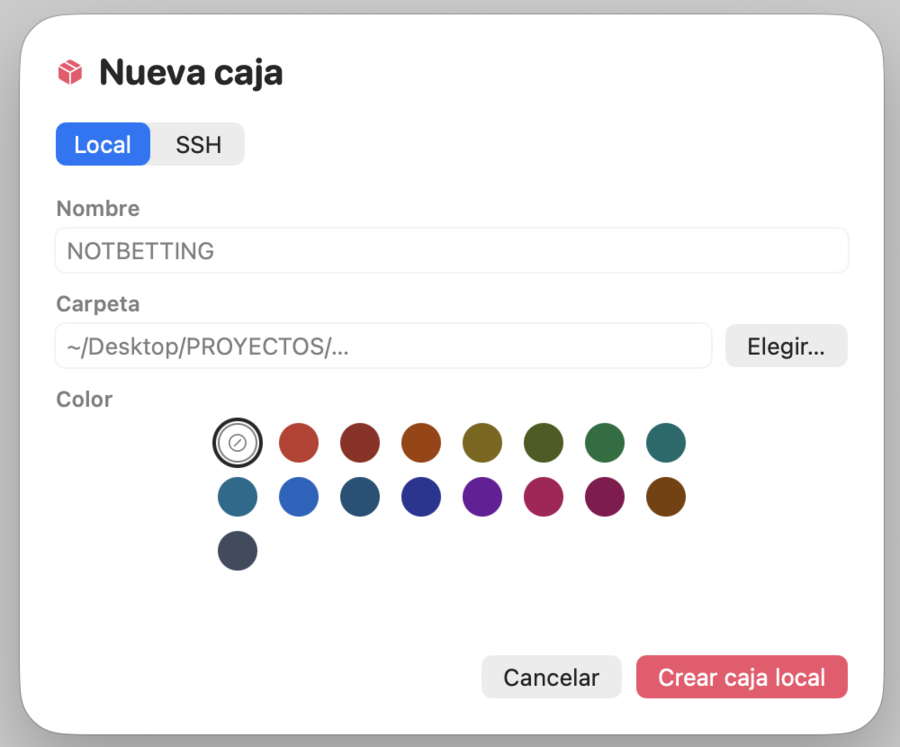
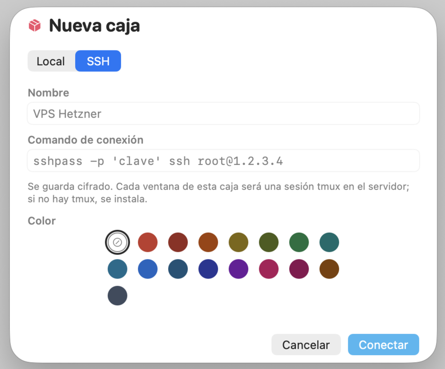
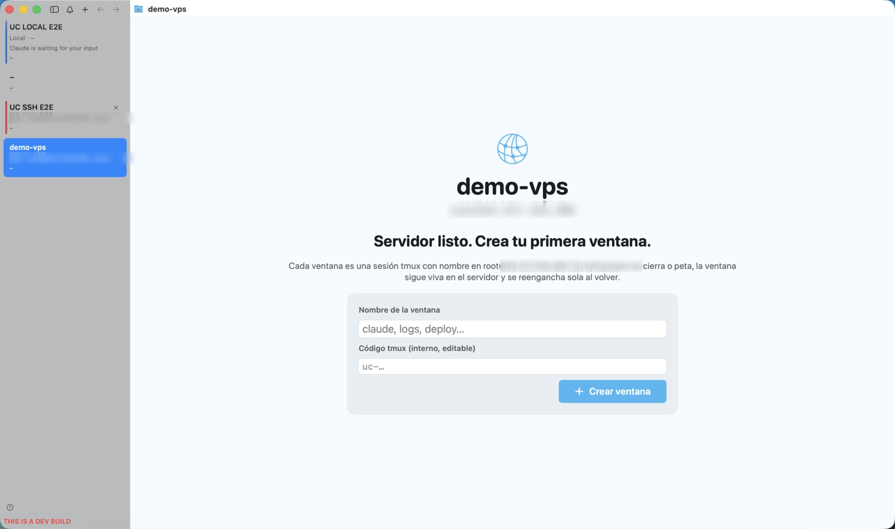
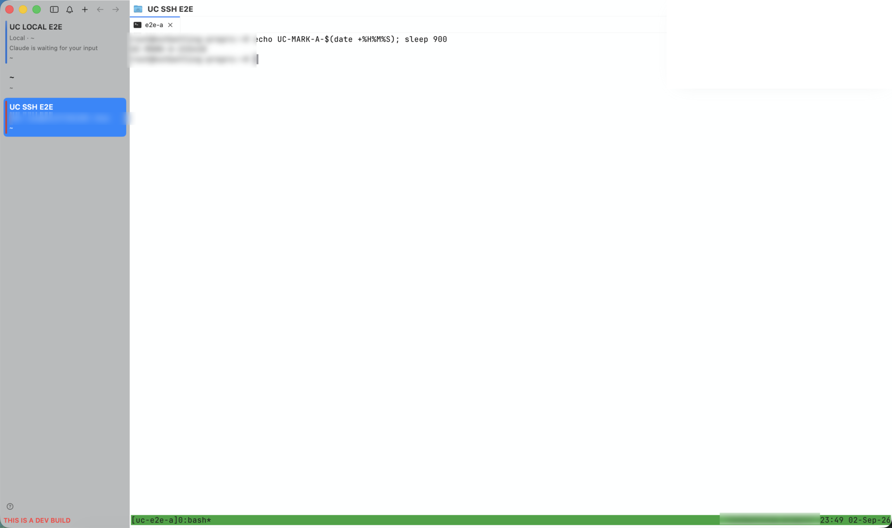

<div align="center">


# UniConnect

**A macOS terminal whose sessions survive quits, crashes and reboots.**<br>
Local boxes resume Claude Code. SSH boxes live in tmux on the server. Everything is encrypted and behind Touch ID.

[](https://www.swift.org)
[](#tech-stack)
[](#installation)
[](#ssh--tmux-workspaces)
[](#ssh--tmux-workspaces)
[](#security-model)
[](#security-model)
[](LICENSE)
[](https://github.com/manaflow-ai/cmux)


<sub>Screenshots come from a Debug build in the light system theme; hostnames and addresses are blurred.</sub>

</div>

---

## Table of contents

- [Overview](#overview)
- [Features](#features)
- [How it works](#how-it-works)
- [Local workspaces](#local-workspaces)
- [SSH + tmux workspaces](#ssh--tmux-workspaces)
- [Session persistence](#session-persistence)
- [Security model](#security-model)
- [Installation](#installation)
- [Build from source](#build-from-source)
- [Usage](#usage)
- [Backup and restore](#backup-and-restore)
- [Tech stack](#tech-stack)
- [Architecture](#architecture)
- [Roadmap](#roadmap)
- [Troubleshooting](#troubleshooting)
- [Contributing](#contributing)
- [License](#license)
- [Credits and upstream](#credits-and-upstream)

## Overview

UniConnect is a fork of [cmux](https://github.com/manaflow-ai/cmux), the Ghostty-based terminal built for AI agent workflows. cmux already restores workspaces and resumes Claude Code sessions. UniConnect adds the missing half for people who live on remote servers:

- Every workspace ("box") is explicitly **Local** or **SSH**.
- Every window inside an SSH box is a **named tmux session on the server**. Quit the app, crash it, reboot the Mac: the process on the server keeps running, and the window re-attaches on the next launch.
- Local windows that were running Claude Code come back with `claude --resume <session> --dangerously-skip-permissions`, with no per-window confirmation.
- Connection commands (including `sshpass` wrappers) are stored in an **encrypted vault**, never in the session snapshot.
- The app opens only after **Touch ID**, can be locked at any time, and exports an **authenticated, encrypted** backup you can import on another Mac.

## Features

| | |
|---|---|
| **Local / SSH chooser on `+`** | Name, folder and color for local boxes; name, color and full connect command for SSH boxes. |
| **tmux-backed windows** | Each SSH window runs `tmux new-session -A -D -s <id>` over `ssh -t`. IDs are validated (`[A-Za-z0-9_-]`, max 40) and suggested automatically. |
| **Server bootstrap** | On creation UniConnect connects, detects tmux, and offers to install it (apt, dnf, yum, apk, pacman, zypper, brew) with live output. |
| **Empty-state onboarding** | A new SSH box opens full-screen with an explanation and a *Create window* call to action. |
| **Claude Code resume** | Session ids captured by cmux's hooks; restore always carries `--dangerously-skip-permissions`. |
| **Closed, not killed** | Closing a window or box never runs `tmux kill-*`. Items go to *Closed* and can be reopened; permanent deletion asks first. |
| **Persist now** | `⌘⌥S` writes the session snapshot plus an encrypted, human-readable backup with 30 rotating copies. |
| **Encrypted export / import** | Versioned JSON container, readable metadata, AES-256-GCM payload, PBKDF2-SHA256 key derivation, preview before import, duplicate detection. |
| **Touch ID gate + Lock** | Required at every launch; `⌘⌃L` locks instantly without touching terminals or tmux. Explicit password fallback for Macs without Touch ID. |
| **No upstream auto-updates** | Sparkle checks are off so an upstream release can never overwrite UniConnect. |

## How it works

```mermaid
flowchart LR
    subgraph mac[Mac]
        UC[UniConnect]
        SNAP[(Session snapshot<br/>no secrets)]
        VAULT[(Vault<br/>AES-256-GCM)]
        KEY[[Master key<br/>0600 file + Keychain mirror]]
        HOOKS[Claude Code hooks<br/>session ids]
        EXPORT[(Encrypted export<br/>PBKDF2 + AES-GCM)]
    end
    subgraph srv[Server]
        TMUX1[tmux session uc-claude-1a2b]
        TMUX2[tmux session uc-logs-9f01]
    end
    UC -- autosave every 8 s --> SNAP
    UC -- connect commands --> VAULT
    KEY -. decrypts .-> VAULT
    HOOKS --> UC
    UC -- "ssh -t … tmux new-session -A -D" --> TMUX1
    UC -- "ssh -t … tmux new-session -A -D" --> TMUX2
    UC -- passphrase --> EXPORT
```



1. cmux's snapshot (`~/Library/Application Support/cmux/session-*.json`) gains two optional fields: a per-workspace profile (`local` or `ssh`, plus an opaque credential id) and a per-terminal tmux session name.
2. The connect command behind that credential id lives in `uniconnect/vault.uc`, sealed with a 256-bit master key.
3. On restore, every terminal that has a tmux name gets a one-shot launcher script that runs the connect command with `-t` and the tmux attach. Scrollback comes from tmux, not from the local replay.
4. Local terminals follow cmux's own agent-resume path; UniConnect only forces the permissions flag.

## Local workspaces

<p align="center"> </p>

Pick a folder, a name and a color. Windows keep their working directory, custom title, splits and, when Claude Code ran inside them, the session id detected by the bundled `claude` wrapper. The restore command is built by cmux's `AgentResumeArgv`; UniConnect appends `--dangerously-skip-permissions` when it is missing and the injected settings carry `skipDangerousModePermissionPrompt`, so nothing stops on a Yes/No prompt.

## SSH + tmux workspaces



1. Paste the full connect command: `ssh user@host`, `ssh -i key.pem -p 2222 user@host`, `sshpass -p '…' ssh user@host`, ProxyJump options, anything that ends in an ssh destination. Client options (`-t`, `StrictHostKeyChecking=accept-new`, keep-alives) are inserted right after the `ssh` word, so wrappers keep working.
2. UniConnect connects with `sh -s` and checks tmux. If it is missing it reports OS, package manager and whether root or password-less sudo is available, and installs only after you confirm.
3. Create windows. Each one asks for a visible name and an internal tmux id (`uc-<slug>-<4 hex>` by default). Duplicate ids inside a box are flagged.



Closing a tab only ends the ssh client; the tmux session and whatever runs inside it stay alive. The tab moves to *Closed* with its tmux id, ready to be reopened.

## Session persistence

- Autosave every 8 seconds, atomic writes, unchanged snapshots skipped.
- A save is forced right after unlocking and after every UniConnect change (new box, new window, color, connection edit, import). An import is preceded by a full snapshot plus an encrypted backup so it can be undone.
- Restore staggers SSH reconnections (0.4 s apart, capped at 6 s) so many boxes do not hammer the servers at once.
- *Persist now* (`⌘⌥S`) additionally writes `uniconnect/backup.uc` and a timestamped copy under `uniconnect/history/`.
- Snapshot schema is versioned; the UniConnect fields are optional, so snapshots written by plain cmux still load.

## Security model

**Where secrets live**

| Data | Location | Protection |
|---|---|---|
| Connect commands (may embed `sshpass` passwords) | `uniconnect/vault.uc` | AES-256-GCM, master key |
| Master key | `uniconnect/.master-key` (0600) + login Keychain mirror | macOS account, FileVault, app lock |
| Session snapshot | `session-*.json` | Contains no secrets: only a credential id and tmux names |
| Portable export | `*.uniconnect` | AES-256-GCM, key from PBKDF2-HMAC-SHA256 (600 000 iterations), random 16-byte salt and 12-byte nonce, KDF parameters in the header, passphrase never stored |

**Authentication.** Touch ID via `LocalAuthentication` at launch, after crash or reboot, on *Lock*, and before export, import or revealing a connect command. On Macs without Touch ID, with no enrolled fingers, or after biometric lockout, the same system dialog falls back to the account password and the lock screen says so. There is no silent bypass; the only way to disable the gate is the `UNICONNECT_DISABLE_LOCK=1` environment variable meant for automated tests.

**Integrity.** GCM authentication covers the payload and the format name. Any modified, truncated or foreign file is rejected before anything is imported; wrong passphrase and tampering produce the same error on purpose.

**What it does not defend against.** Malware running as your user while the session is unlocked (it can read the master key file), an attacker with root, screen capture of an unlocked window, a compromised server, and the fact that `sshpass` exposes the password in the local process list for the duration of the connection, exactly as it does when typed by hand. The full threat model and the reasons behind the file-based master key are in [`docs/UNICONNECT.md`](docs/UNICONNECT.md).

## Installation

UniConnect is distributed as source. Build it once with Xcode 26 and install the resulting bundle:

```bash
git clone --recurse-submodules https://github.com/Unixcision/uniconnect.git
cd uniconnect
./scripts/setup.sh            # submodules, prebuilt GhosttyKit, git hooks
bash ../uniconnect-install-patched.sh   # Release build, ad-hoc signature, /Applications
```

The installer keeps the bundle id `com.cmuxterm.app` so existing cmux sessions, preferences and the `cmux` CLI keep working, backs up the previous app to the Desktop, and disables Sparkle update checks on the installed copy.

## Build from source

```bash
./scripts/ensure-ghosttykit.sh                       # downloads the pinned GhosttyKit.xcframework
CMUX_SKIP_ZIG_BUILD=1 ./scripts/reload.sh --tag dev  # Debug build: "UniConnect DEV dev.app"
CMUX_SKIP_ZIG_BUILD=1 xcodebuild test -project cmux.xcodeproj -scheme cmux-unit \
  -destination 'platform=macOS' -only-testing:cmuxTests/UniConnectTests
```

Requirements: macOS 14+, Xcode 26, zig 0.15.2 only if you want to rebuild GhosttyKit yourself.

## Usage

| Action | Where |
|---|---|
| New box (Local or SSH) | `+` in the title bar, or **UniConnect ▸ Nueva caja…** |
| New tmux window in an SSH box | `⌘T`, the tab-bar `+`, or **UniConnect ▸ Nueva ventana tmux…** |
| Edit the connect command | **UniConnect ▸ Editar conexión SSH…** (Touch ID) |
| Persist now | `⌘⌥S` |
| Export / import configuration | **UniConnect ▸ Exportar… / Importar…** |
| Seed template for a first configuration | **UniConnect ▸ Guardar plantilla inicial…** |
| Reopen or permanently delete closed items | **UniConnect ▸ Cerradas…** |
| Kill the tmux session behind the active window (asks first) | **UniConnect ▸ Terminar sesión tmux remota…** |
| Lock | `⌘⌃L` |
| Auto-lock after idle time | **UniConnect ▸ Bloqueo automático por inactividad** (off by default) |
| Last save time | shown at the bottom of the **UniConnect** menu |

First-run seeding: put a plain JSON seed (see the template) in a file and launch once with `UNICONNECT_IMPORT_SEED=/path/to/seed.json`. The file is applied a single time; afterwards use the encrypted export.

## Backup and restore

```text
~/Library/Application Support/cmux/
├── session-com.cmuxterm.app.json        # cmux snapshot + UniConnect fields (no secrets)
└── uniconnect/
    ├── vault.uc                         # connect commands, encrypted
    ├── .master-key                      # 0600
    ├── backup.uc                        # last "Persist now"
    └── history/backup-<timestamp>.uc    # 30 rotating copies
$TMPDIR/uniconnect-launchers/            # one-shot zsh launchers (0700), purged hourly
```

Export writes a `.uniconnect` container:

```json
{
  "format": "uniconnect-export", "version": 1,
  "meta": { "app": "UniConnect", "savedAt": "…", "workspaces": 12 },
  "payload": { "format": "uniconnect-aesgcm", "kdf": "pbkdf2-sha256", "iterations": 600000,
               "salt": "…", "nonce": "…", "ciphertext": "…", "tag": "…" }
}
```

Import authenticates you, validates the container, asks for the passphrase, shows a preview without secrets and lets you pick which boxes to create. Boxes whose name already exists are unchecked by default.

## Tech stack

- **Swift 6**, **SwiftUI** for the UniConnect screens, **AppKit** for sheets, alerts and the lock window.
- **Ghostty** (`GhosttyKit.xcframework`) as the terminal engine, inherited from cmux.
- **OpenSSH** client and **tmux** on the server; no daemon to install.
- **CryptoKit** (AES-GCM, SHA-256) and **CommonCrypto** (PBKDF2).
- **Security.framework** Keychain and **LocalAuthentication**.
- **XCTest** unit tests (`cmuxTests/UniConnectTests.swift`).

## Architecture

```text
Sources/UniConnect/
├── UniConnectModels.swift       # profiles, readable document, errors
├── UniConnectVault.swift        # AES-GCM envelope, PBKDF2, master key, vault
├── UniConnectSSH.swift          # connect-command surgery, tmux command, launcher, probe/installer
├── UniConnectBackup.swift       # document builder, persist now, export/import, seed template
├── UniConnectAppLock.swift      # Touch ID gate, Lock, fallback policy
├── UniConnectViews.swift        # new-box sheet, SSH empty state, new-window sheet, passphrase, preview
└── UniConnectCoordinator.swift  # glue with TabManager/Workspace, menu actions, Closed items
```

Hooks into cmux are deliberately small: two optional snapshot fields, three stored properties on `Workspace`, a startup-command override in the panel restore path, an overlay on `WorkspaceContentView`, the `+` and `⌘T` intercepts, the UniConnect menu, and one line in `AgentResumeArgv`.

## Roadmap

- In-tab "Reconnect" button for a window whose ssh client died (today the tab is kept with Ghostty's `[exited]` banner and a `· desconectada` suffix; reopen it from *Closed*).
- Local / SSH badge in the sidebar row itself (today it is the box description).
- Optional Data Protection Keychain master key for builds signed with a stable identity.
- Localized UI strings for the UniConnect screens (currently Spanish).

## Troubleshooting

| Symptom | Cause / fix |
|---|---|
| App hangs at launch on a fresh build | macOS is waiting to show a permission dialog (Desktop access, local network, Keychain). Unlock the screen and answer it. |
| "tmux no está instalado" inside a window | The probe was skipped or the server changed; open **Editar conexión** and re-run the check, or install tmux manually. |
| Window reconnects to an empty shell | The tmux session id changed on the server; compare with `tmux ls` and reopen the tab from *Closed* with the right id. |
| Claude prompts "Bypass Permissions mode" on restore | Make sure `~/.claude/settings.json` has `"skipDangerousModePermissionPrompt": true`; the bundled wrapper also injects it. |
| Vault unreadable after reinstall | `.master-key` and the Keychain mirror were both removed. Import your last encrypted export. |

## Contributing

Issues and pull requests are welcome on [Unixcision/uniconnect](https://github.com/Unixcision/uniconnect). Keep `cmux.xcodeproj/project.pbxproj` normalized (`scripts/normalize-pbxproj.py`), wire new tests into the project, and never commit secrets, hostnames or screenshots with private data.

## License

UniConnect is released under the [MIT License](LICENSE), the same license as cmux. Third-party notices are listed in [THIRD_PARTY_LICENSES.md](THIRD_PARTY_LICENSES.md).

## Credits and upstream

UniConnect is built on **[cmux](https://github.com/manaflow-ai/cmux)** by [Manaflow](https://github.com/manaflow-ai) and on **[Ghostty](https://github.com/ghostty-org/ghostty)** by Mitchell Hashimoto and contributors. The `upstream` remote points at `manaflow-ai/cmux` so improvements can be merged back in; the original README lives in that repository.
