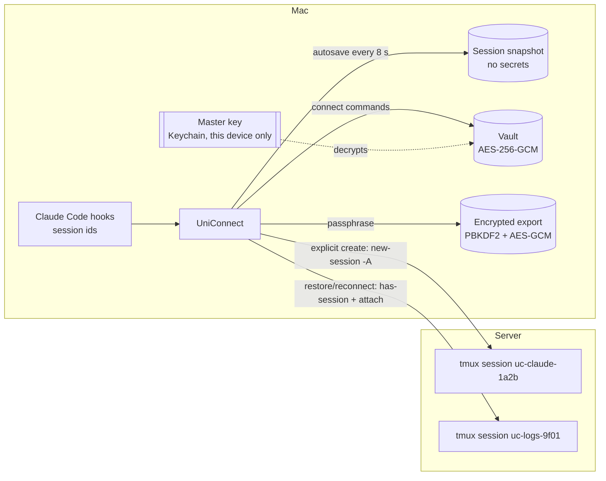
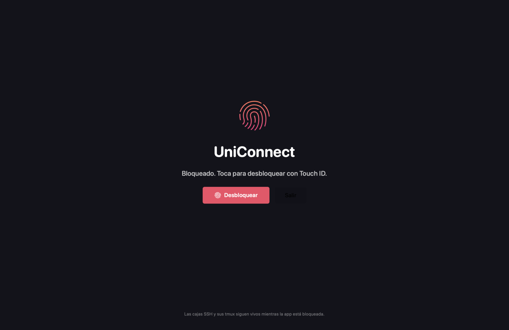

<div align="center">


# UniConnect

**A macOS terminal whose sessions survive quits, crashes and reboots.**<br>
Local boxes resume terminals and Claude, Codex, Agy, Grok, or custom CLI conversations. SSH boxes live in tmux on the server. Work-state JSON stays readable and local; only SSH connection material is encrypted, and sensitive controls are behind Touch ID.

[](https://www.swift.org)
[](#tech-stack)
[](#installation)
[](#ssh--tmux-workspaces)
[](#ssh--tmux-workspaces)
[](#security-model)
[](#security-model)
[](LICENSE)
[](https://github.com/manaflow-ai/cmux)


<sub>Screenshots come from a Debug build in the light system theme; hostnames and addresses are blurred.</sub>

</div>

---

## Table of contents

- [Overview](#overview)
- [Features](#features)
- [How it works](#how-it-works)
- [Local workspaces](#local-workspaces)
- [SSH + tmux workspaces](#ssh--tmux-workspaces)
- [Session persistence](#session-persistence)
- [Security model](#security-model)
- [Installation](#installation)
- [Build from source](#build-from-source)
- [Usage](#usage)
- [Backup and restore](#backup-and-restore)
- [Tech stack](#tech-stack)
- [Architecture](#architecture)
- [Roadmap](#roadmap)
- [Troubleshooting](#troubleshooting)
- [Contributing](#contributing)
- [License](#license)
- [Credits and upstream](#credits-and-upstream)

## Overview

UniConnect is a fork of [cmux](https://github.com/manaflow-ai/cmux), the Ghostty-based terminal built for AI agent workflows. cmux already restores workspaces and resumes Claude Code sessions. UniConnect adds the missing half for people who live on remote servers:

- Every workspace ("box") is explicitly **Local** or **SSH**.
- Every window inside an SSH box is a **named tmux session on the server**. Quit the app, crash it, reboot the Mac: the process on the server keeps running, and the window re-attaches on the next launch.
- Local windows are durable terminals. They can run Claude, Codex, Agy, Grok or a custom CLI; leaving an agent returns to the normal shell and its conversation remains available from the window menu.
- Connection commands (including `sshpass` wrappers) are stored in an **encrypted vault**, never in the session snapshot.
- The app opens only after **Touch ID**, can be locked at any time, and exports an **authenticated, encrypted** backup you can import on another Mac.

## Features

| | |
|---|---|
| **Local / SSH chooser on `+`** | Name, folder and color for local boxes; name, color and full connect command for SSH boxes. |
| **tmux-backed windows** | Explicit creation uses `tmux new-session -A -s <id>` over `ssh -t`. Restore and reconnect first require the saved session and use attach-only semantics, so a missing tmux can never be replaced by an empty one. IDs are validated (`[A-Za-z0-9_-]`, max 40) and suggested automatically. |
| **Server bootstrap** | On creation UniConnect connects, detects tmux, and offers to install it (apt, dnf, yum, apk, pacman, zypper, brew) with live output. |
| **Empty-state onboarding** | A new SSH box opens full-screen with an explanation and a *Create window* call to action. |
| **Recoverable local agents** | Every window keeps its name, trusted folder and append-only conversation history. Claude/Agy use `--dangerously-skip-permissions`; Codex uses `--yolo`; a session UUID can have only one active owner. |
| **Immediate SSH refresh** | `⌘R` rebuilds the focused SSH/tmux window immediately; `⌃⌘R` does the same for every eligible SSH window. Both terminate only UniConnect's local SSH process groups and never wait for OpenSSH's timeout. |
| **Private completion bridge** | Namespaced Claude lifecycle hooks send minimal, authenticated events through the SSH connection to UniConnect's loopback listener and notification centre. Existing remote hooks are merged and restored safely. |
| **Image upload progress** | Clipboard, drag/drop and file actions use the box type as their only routing source. SSH uploads show an exact percentage, progress bar, cancellation and real errors. |
| **Closed, not killed** | Closing a window or box never runs `tmux kill-*`. Items go to *Closed* and can be reopened; permanent deletion asks first. |
| **Always recoverable** | Every relevant model mutation requests an immediate atomic save. Automatic recovery points run every six hours and retain seven days (at most 28); readable session JSON and the encrypted SSH vault are archived separately. |
| **Encrypted export / import** | Versioned JSON container, readable metadata, AES-256-GCM payload, PBKDF2-SHA256 key derivation, preview before import, duplicate detection. |
| **Touch ID gate + Lock** | Required at every launch; `⌘⌃L` locks instantly without touching terminals or tmux. Explicit password fallback for Macs without Touch ID. |
| **No upstream auto-updates** | Sparkle checks are off so an upstream release can never overwrite UniConnect. |

## How it works



1. UniConnect's own snapshot (`~/Library/Application Support/UniConnect/session-*.json`, same format as cmux's) gains two optional fields: a per-workspace profile (`local` or `ssh`, plus an opaque credential id) and a per-terminal tmux session name.
2. The connect command behind that credential id lives in `uniconnect/vault.uc`, sealed with a 256-bit master key.
3. On restore, every terminal that has a tmux name gets a one-shot launcher script that runs the connect command with `-t` and the tmux attach. Scrollback comes from tmux, not from the local replay.
4. Local windows start as login shells. UniConnect records the logical agent/session binding and reconstructs only trusted executable names plus the required permission flag; captured argv and environment secrets are never replayed.

## Local workspaces

<p align="center"> </p>

Pick a trusted folder, name and colour. A new window can be a normal terminal, Claude, Codex, Agy, Grok or a custom CLI. Running `/exit` in an agent returns to that window's login shell; running shell `exit` marks the terminal stopped but keeps it reopenable. Its durable record preserves the visible name, box root and every known conversation. Reopen, resume or switch agent from the same shared action menu used by the rail, flyout and terminal context menu.

## SSH + tmux workspaces


1. Paste the full connect command: `ssh user@host`, `ssh -i key.pem -p 2222 user@host`, `sshpass -p '…' ssh user@host`, ProxyJump options, anything that ends in an ssh destination. Client options (`-t`, `StrictHostKeyChecking=accept-new`, keep-alives) are inserted right after the `ssh` word, so wrappers keep working.
2. UniConnect connects with `sh -s` and checks tmux. If it is missing it reports OS, package manager and whether root or password-less sudo is available, and installs only after you confirm.
3. Create windows. Each one asks for a visible name and an internal tmux id (`uc-<slug>-<4 hex>` by default). Duplicate ids inside a box are flagged.


Closing a tab only ends the local SSH client; the tmux session and whatever runs inside it stay alive. The tab moves to *Closed* with its tmux id, ready to be reopened. If the network changes and OpenSSH hangs, **Reconnect Now** (`⌘R`) replaces only that focused local client and reattaches the same tmux immediately; `⌃⌘R` refreshes every eligible SSH window.

## Session persistence

- Autosave runs every 8 seconds with atomic writes; even an unchanged fingerprint is persisted at least once per minute.
- A save is requested immediately after every recovery-relevant change: membership and order, selection, names, colours, folder, panel layout, profile, credential reference, tmux binding, local agent history and runtime/disconnect state.
- Restore staggers SSH reconnections (0.4 s apart, capped at 6 s) so many boxes do not hammer the servers at once.
- A scheduled archive is created every six hours. It keeps seven days / at most 28 points under `~/.uniconnect/backups`; readable session JSON is separate from the still-encrypted credential vault. Restore creates an additional before-restore point.
- *Persist now* (`⌘S`) additionally writes the authenticated manual backup and its bounded history.
- Snapshot schema is versioned; the UniConnect fields are optional, so snapshots written by plain cmux still load.

## Security model

**Where secrets live**

| Data | Location | Protection |
|---|---|---|
| Connect commands (may embed `sshpass` passwords) | `uniconnect/vault.uc` | AES-256-GCM, master key |
| Master key | Data-protection Keychain (`WhenUnlockedThisDeviceOnly`) | macOS account, device binding and app lock; Release has no plaintext key file |
| Session snapshot | `session-*.json` | Contains no secrets: only a credential id and tmux names |
| Portable export | `*.uniconnect` | AES-256-GCM, key from PBKDF2-HMAC-SHA256 (600 000 iterations), random 16-byte salt and 12-byte nonce, KDF parameters in the header, passphrase never stored |

**Authentication.** Touch ID via `LocalAuthentication` at launch, after crash or reboot, on *Lock*, and before export, import or revealing a connect command. On Macs without Touch ID, with no enrolled fingers, or after biometric lockout, the same system dialog falls back to the account password and the lock screen says so. There is no silent bypass in Release builds; Debug/XCTest builds keep the explicit `UNICONNECT_DISABLE_LOCK=1` automation seam.



**Integrity.** GCM authentication covers the payload and the format name. Any modified, truncated or foreign file is rejected before anything is imported; wrong passphrase and tampering produce the same error on purpose.

**What it does not defend against.** Malware running as your user while the account and Keychain are unlocked, an attacker with root, screen capture of an unlocked window or a compromised SSH server. The bridge deliberately carries no prompt or response content. The full threat model and operational limits are documented with the security architecture.

## Installation

UniConnect is distributed as source. Build it once with Xcode 26 and install the resulting bundle:

```bash
git clone --recurse-submodules https://github.com/Unixcision/uniconnect.git
cd uniconnect
./scripts/setup.sh            # submodules, prebuilt GhosttyKit, git hooks
./scripts/build-local-release.sh
# Inspect the signed candidate with the read-only installer first:
./scripts/install.sh --app "/absolute/path/to/UniConnect.app"
```

The Release builder requires a stable Apple Development identity with its private key and refuses ad-hoc signing. The installer is read-only by default, verifies the designated requirement before closing anything, keeps a recoverable copy under `~/.uniconnect/backups/install/`, and mutates `/Applications` only when explicitly passed `--apply`. See [`docs/UNICONNECT-SIGNING.md`](docs/UNICONNECT-SIGNING.md).

UniConnect has its own bundle id (`com.unixcision.uniconnect`), Application Support, configuration, state, socket, Keychain and notification namespaces, so it can live next to cmux without touching cmux's sessions or history. The command-line executable intentionally keeps the upstream-compatible name `cmux`.

## Build from source

```bash
./scripts/ensure-ghosttykit.sh                       # downloads the pinned GhosttyKit.xcframework
CMUX_SKIP_ZIG_BUILD=1 ./scripts/reload.sh --tag dev  # Debug build: "UniConnect DEV dev.app"
swift test --package-path Packages/UniConnectClaudeBridge
swift test --package-path Packages/UniConnectClaudeUpdate
```

Requirements: macOS 14+, Xcode 26, zig 0.15.2 only if you want to rebuild GhosttyKit yourself.

## Usage

| Action | Where |
|---|---|
| New box (Local or SSH) | `+` in the title bar, or **UniConnect ▸ Nueva caja…** |
| New window in the current box | `⌘T` or the tab-bar `+`; Local shows the terminal/agent picker and SSH creates a named tmux window |
| Reconnect the focused SSH/tmux window now | `⌘R` or **Reconnect Now** |
| Reconnect all eligible SSH/tmux windows now | `⌃⌘R` or **Reconnect All SSH Windows** |
| Edit the connect command | **UniConnect ▸ Editar conexión SSH…** (Touch ID) |
| Persist now | `⌘S` |
| Export / import configuration | **UniConnect ▸ Exportar… / Importar…** |
| Seed template for a first configuration | **UniConnect ▸ Guardar plantilla inicial…** |
| Reopen or permanently delete closed items | **UniConnect ▸ Cerradas…** |
| Kill the tmux session behind the active window (asks first) | **UniConnect ▸ Terminar sesión tmux remota…** |
| Lock | `⌘⌃L` |
| Auto-lock after idle time | **UniConnect ▸ Bloqueo automático por inactividad** (off by default) |
| Last save time | shown at the bottom of the **UniConnect** menu |

First-run import reads the human `CONNECT.md` format directly and presents a secret-free, selectable preview of creates, updates, unchanged rows, conflicts and rejected entries. Existing tmux targets are preflighted read-only before any local mutation; import is journaled, verified and rolled back exactly on failure. The legacy JSON seed remains supported for controlled provisioning.

## Backup and restore

```text
~/Library/Application Support/UniConnect/
├── session-com.unixcision.uniconnect-uniconnect.json  # snapshot + UniConnect fields (no secrets)
├── vault.uc                         # connect commands, encrypted
├── backup.json                      # last readable "Persist now" (no secrets)
├── backup-<uuid>.vault.uc           # encrypted companion selected by backup.json
└── history/
    ├── backup-<timestamp>-<uuid>.json      # bounded readable manual history
    └── backup-<timestamp>-<uuid>.vault.uc  # matching encrypted SSH vault
~/.uniconnect/backups/
├── session-<timestamp>-scheduled-<uuid>.json      # readable, sanitised state
└── session-<timestamp>-scheduled-<uuid>.vault.uc  # matching encrypted SSH vault
$TMPDIR/uniconnect-launchers/            # one-shot zsh launchers (0700), purged hourly
```

Export writes a `.uniconnect` container:

```json
{
  "format": "uniconnect-export", "version": 1,
  "meta": { "app": "UniConnect", "savedAt": "…", "workspaces": 12 },
  "payload": { "format": "uniconnect-aesgcm", "kdf": "pbkdf2-sha256", "iterations": 600000,
               "salt": "…", "nonce": "…", "ciphertext": "…", "tag": "…" }
}
```

Import authenticates you, validates the container, asks for the passphrase, shows a preview without secrets and lets you pick which boxes to create. Boxes whose name already exists are unchecked by default.

## Tech stack

- **Swift 6**, **SwiftUI** for the UniConnect screens, **AppKit** for sheets, alerts and the lock window.
- **Ghostty** (`GhosttyKit.xcframework`) as the terminal engine, inherited from cmux.
- **OpenSSH** client and **tmux** on the server; no daemon to install.
- **CryptoKit** (AES-GCM, SHA-256) and **CommonCrypto** (PBKDF2).
- **Security.framework** Keychain and **LocalAuthentication**.
- **XCTest** unit tests (`cmuxTests/UniConnectTests.swift`).

## Architecture

```text
Sources/UniConnect/
├── UniConnectModels.swift       # profiles, readable document, errors
├── UniConnectVault.swift        # AES-GCM envelope, PBKDF2, master key, vault
├── UniConnectSSH.swift          # connect-command surgery, tmux command, launcher, probe/installer
├── UniConnectBackup.swift       # document builder, persist now, export/import, seed template
├── UniConnectAppLock.swift      # Touch ID gate, Lock, fallback policy
├── UniConnectViews.swift        # new-box sheet, SSH empty state, new-window sheet, passphrase, preview
└── UniConnectCoordinator.swift  # glue with TabManager/Workspace, menu actions, Closed items
```

Hooks into cmux are deliberately small: two optional snapshot fields, three stored properties on `Workspace`, a startup-command override in the panel restore path, an overlay on `WorkspaceContentView`, the `+` and `⌘T` intercepts, the UniConnect menu, and one line in `AgentResumeArgv`.

## Implementation guides

- [`docs/UNICONNECT.md`](docs/UNICONNECT.md): persistence, security boundaries and runtime architecture.
- [`docs/UNICONNECT-NOTIFICATION-BRIDGE.md`](docs/UNICONNECT-NOTIFICATION-BRIDGE.md): authenticated SSH completion bridge.
- [`docs/UNICONNECT-CLAUDE-UPDATE.md`](docs/UNICONNECT-CLAUDE-UPDATE.md): recoverable Claude update state machine.
- [`docs/UNICONNECT-SIDEBAR-2026.md`](docs/UNICONNECT-SIDEBAR-2026.md): expanded sidebar, compact rail and flyout.
- [`docs/UNICONNECT-RECOVERY.md`](docs/UNICONNECT-RECOVERY.md): save triggers, rolling archive and recovery playbooks.
- [`docs/UNICONNECT-CMUX-MIGRATION.md`](docs/UNICONNECT-CMUX-MIGRATION.md): explicit read-only migration boundary.
- [`docs/UNICONNECT-CONNECT-IMPORT.md`](docs/UNICONNECT-CONNECT-IMPORT.md): Markdown preview, reconciliation and transactional rollback.
- [`docs/UNICONNECT-DESKTOP-PHASE2.md`](docs/UNICONNECT-DESKTOP-PHASE2.md): private inventory and rollback-only plan; no files are moved.
- [`docs/MENUS.md`](docs/MENUS.md): menu ownership, availability and shortcuts.

## Troubleshooting

| Symptom | Cause / fix |
|---|---|
| App hangs at launch on a fresh build | macOS is waiting to show a permission dialog (Desktop access, local network, Keychain). Unlock the screen and answer it. |
| "tmux no está instalado" inside a window | The probe was skipped or the server changed; open **Editar conexión** and re-run the check, or install tmux manually. |
| A saved SSH window says its tmux is missing | Restore intentionally refuses to create an empty replacement. Verify the saved id on the server, then create or bind a window explicitly. |
| Claude prompts "Bypass Permissions mode" on restore | Make sure `~/.claude/settings.json` has `"skipDangerousModePermissionPrompt": true`; the bundled wrapper also injects it. |
| Vault unreadable after reinstall | The Release Keychain item is missing or the app identity changed. Do not overwrite the vault; restore the signed app backup or import the last encrypted export. |

## Contributing

Issues and pull requests are welcome on [Unixcision/uniconnect](https://github.com/Unixcision/uniconnect). Keep `cmux.xcodeproj/project.pbxproj` normalized (`scripts/normalize-pbxproj.py`), wire new tests into the project, and never commit secrets, hostnames or screenshots with private data.

## License

UniConnect is distributed under the open-source [GNU General Public License v3.0 or later](LICENSE). The inherited cmux license also describes a commercial option from Manaflow for rights that Manaflow is able to license; that offer is not made by Unixcision. Third-party notices are listed in [THIRD_PARTY_LICENSES.md](THIRD_PARTY_LICENSES.md).

## Credits and upstream

UniConnect is built on **[cmux](https://github.com/manaflow-ai/cmux)** by [Manaflow](https://github.com/manaflow-ai) and on **[Ghostty](https://github.com/ghostty-org/ghostty)** by Mitchell Hashimoto and contributors. The `upstream` remote points at `manaflow-ai/cmux` so improvements can be merged back in; the original README lives in that repository.
