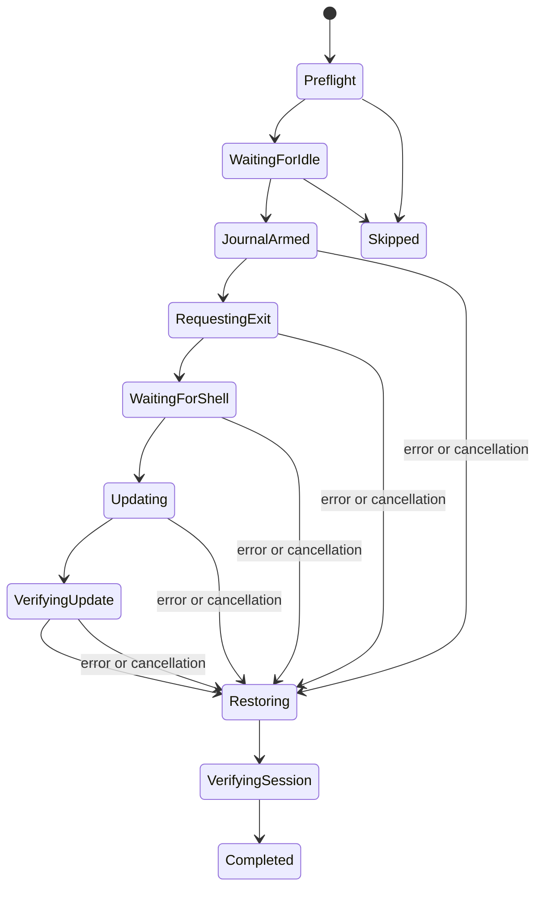

# Actualización segura de Claude Code

## Objetivo

UniConnect actualiza la instalación de Claude Code sin perder la relación entre una ventana y
su sesión. El flujo admite tres ámbitos: la ventana seleccionada, todas las ventanas de la caja
actual y todas las ventanas abiertas. La misma acción compartida alimenta menú principal, menú
contextual, paleta y rail; ninguna entrada ejecuta comandos por su cuenta.

El núcleo independiente está en `Packages/UniConnectClaudeUpdate`. Solo conoce valores
`Sendable` y protocolos de descubrimiento, control de sesión, actualización del binario,
journal y logging. Los adaptadores de AppKit, procesos, terminal, SSH/tmux y bóveda viven en
`Sources/UniConnect`; `cmuxApp` ensambla las implementaciones concretas.

## Preflight y agrupación

Antes de enviar una sola tecla, el proveedor crea snapshots inmutables de cajas y paneles. Una
ventana local necesita UUID válido, cwd absoluto existente, transcript restaurable, ejecutable
absoluto y un único proceso Claude en primer plano perteneciente al panel. Una ventana SSH
necesita además una credencial opaca, sesión tmux saneada, pane exacto y journal autenticado del
bridge. Una raíz `CLAUDE_CONFIG_DIR` personalizada no se supone: mientras no forme parte del
modelo persistido, el target se omite de forma segura.

`ClaudeUpdatePlan` rechaza antes de mutar:

- IDs visibles duplicados;
- dos ventanas con el mismo UUID de Claude;
- dos ventanas remotas dueñas del mismo pane;
- más de una instalación o ruta de ejecutable dentro del mismo host lógico;
- una selección que no coincide exactamente con el target solicitado.

Los targets no resolubles permanecen en el resumen como omitidos. Los resolubles se agrupan por
Mac o UUID de credencial SSH, por lo que `claude update` se ejecuta una sola vez por instalación y
host.

## Máquina de estados

Cada transición se publica como un snapshot inmutable para la ventana de progreso. Confirmar
vuelve a descubrir y validar el plan; la UI reemplaza su preview por ese plan fresco. Solo se
acepta una actualización cuando el comando termina de forma controlada y la combinación de
salida y versiones anterior/posterior demuestra `updated` o `alreadyUpdated`.

## Journal y cancelación

Antes de solicitar `/exit`, UniConnect persiste una obligación de restauración en
`~/.uniconnect/claude-update/recovery.json` (o en un directorio aislado para builds etiquetadas).
El fichero es JSON versionado, propiedad del usuario, modo `0600`, dentro de un directorio
`0700`. Se escribe en un temporal exclusivo, se hace `fsync`, se renombra atómicamente y se
sincroniza el directorio. No contiene comandos SSH ni credenciales: solo IDs opacos y la identidad
necesaria para reanudar exactamente la sesión.

Cancelar impide nuevas salidas y nuevas actualizaciones, pero no cancela las restauraciones ya
armadas. Esas restauraciones se ejecutan en tareas que ignoran la cancelación del consumidor y el
journal solo se borra después de verificar UUID, cwd, ejecutable, pane y versión. Al arrancar, el
orquestador reconcilia cualquier obligación pendiente antes de aceptar otra actualización.

El runner de procesos limita stdout/stderr, no usa shell local, impone timeout, envía TERM y luego
KILL si hace falta. El callback de terminación de la app cancela de forma síncrona todos los hijos
propiedad del updater; una sesión que ya hubiese salido sigue protegida por el journal para el
siguiente arranque.

## Flujo local

1. Se verifica de nuevo el PID en primer plano, UUID, cwd y ejecutable.
2. Solo cuando Claude está idle se escribe `/exit` en el panel exacto.
3. Se espera la salida de ese PID y la vuelta de la shell del mismo panel.
4. Se ejecutan `<ejecutable> --version`, `<ejecutable> update` y de nuevo `--version` mediante
   `Process`, nunca mediante `zsh -lc`.
5. Se envía al panel el wrapper de UniConnect con cwd citado, ejecutable exacto,
   `--resume <uuid>` y `--dangerously-skip-permissions`.
6. El hook y el inspector deben confirmar la misma identidad antes de limpiar el journal.

## Flujo SSH/tmux

Los procesos de mantenimiento usan un SSH separado y no interactivo. El parser acepta únicamente
conexiones SSH válidas; `sshpass` recibe la contraseña mediante `SSHPASS` y `-e`, nunca por argv.
El proceso fuerza `ControlMaster=no`, `ControlPath=none`, `ClearAllForwardings=yes`, desactiva
comandos locales y filtra opciones incompatibles. La identidad del host en planes y logs es el UUID
de credencial, no el endpoint.

El probe remoto, acotado y de solo lectura, exige Linux, Python 3 y `/proc`. Cruza la ruta del
bridge, sesión/pane tmux, árbol de procesos, grupo en primer plano, ejecutable, cwd, UUID y
transcript. Si no obtiene exactamente un candidato, no envía teclas. La salida limpia usa
`tmux send-keys` solo después de repetir las comprobaciones y cerrar la carrera con un
`UserPromptSubmit` tardío. La actualización se ejecuta fuera del pane mediante el SSH controlado.
La restauración vuelve al mismo pane y solo concluye tras un `SessionStart` autenticado con el UUID,
cwd y pane esperados, seguido de una inspección completa.

La ausencia de Python 3, un tmux desaparecido, un host desconectado, un UUID ambiguo, un pane
duplicado o una instalación distinta producen omisión/fallo visible; nunca activan `--continue` ni
un envío a ciegas.

## Datos y logs

El log estructurado rota a 2 MiB y solo admite operation UUID, target UUID, `local` o UUID de
credencial, fase, severidad y código de error. No serializa endpoints, usuario, contraseña,
rutas de clave, comando de conexión, prompts, respuestas ni transcripts. La salida saneada de
`claude update` queda acotada al resultado en memoria y no se escribe en el log estructurado.

## Pruebas

Las suites puras del paquete cubren planificación, duplicados, agrupación por host, secuencia de
estados, exclusión mutua, fallo de actualización, cancelación y recuperación durable. Las pruebas
del target macOS cubren runner, timeout/cancelación, límites de salida, argv SSH, `sshpass` por
entorno, journal atómico, permisos y redacción de logs. Las pruebas E2E deben usar únicamente
sesiones locales y tmux sacrificables con prefijo de test; jamás se ejecuta `/exit` ni
`claude update` sobre las conversaciones reales del usuario.
