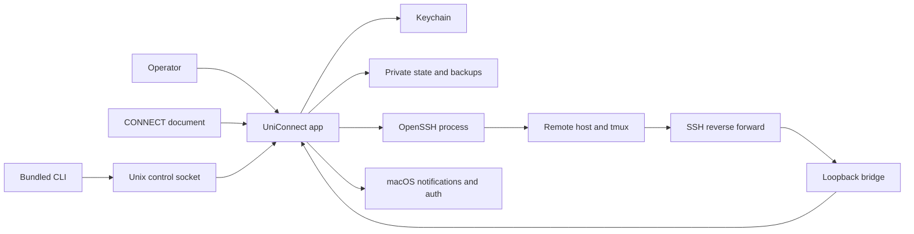

# UniConnect threat model

## Executive summary

UniConnect is a single-user macOS terminal workspace manager whose highest-value assets are SSH credentials and the exact state needed to recover local agent sessions and remote tmux sessions. Its highest risks are inconsistent session/vault snapshots during a crash, accepting an unverified SSH host on first contact, and crossing the local-to-remote boundary through imported commands, Claude hooks, image uploads, and updater subprocesses. Existing controls are substantial—Keychain-backed AES-GCM storage, shell-independent SSH parsing, private atomic files, loopback-only bridge ingress, HMAC authentication, replay limits, and fail-closed LOCAL/SSH routing—but host-key policy, first bridge enrollment, directory-chain permissions, and crash recovery still require explicit hardening or final E2E proof.

## Scope and assumptions

In scope:

- The UniConnect macOS app, bundled cmux CLI, local socket, persistence, recovery backups, CONNECT.md import, SSH/tmux reconnect, Claude updater, completion bridge, and image transfer.
- Security-sensitive runtime code in Sources/UniConnect, Sources/SessionPersistence.swift, Sources/TerminalImageTransfer.swift, Sources/TerminalRemoteFileUploader.swift, CLI, Packages/UniConnectClaudeBridge, and Packages/UniConnectClaudeUpdate.
- Release identity and signing guards where they protect the installed app and macOS permissions.

Out of scope:

- The web control plane, iOS client, third-party remote administration, and CI except for the signed macOS artifact.
- Defending against arbitrary code execution as the logged-in Mac user; such an attacker can observe terminals and invoke user-authorized processes even when files are private.

Assumptions, left unconfirmed after the requested user check-in:

- The Mac is a private, single-user workstation.
- SSH servers are operator-selected but can be unavailable, misconfigured, or compromised; remote data is untrusted.
- UniConnect is not multi-tenant and exposes no public listener. Bridge ingress is loopback reached through an app-created SSH reverse forward.
- macOS Keychain, LocalAuthentication, the signed app, /usr/bin/ssh, and allowlisted sshpass paths are trusted.
- CONNECT.md is operator-controlled but can be stale or modified by a compromised editor or sync process.

Open questions that would change rankings:

- Is the Mac shared with other interactive accounts or same-login management agents?
- Can UniConnect prohibit StrictHostKeyChecking=no and require a known or confirmed host fingerprint?
- Are any remote hosts third-party operated, making even route-scoped notifications untrustworthy?

## System model

### Primary components

- **App and composition root.** cmuxApp builds the coordinator, persistence, bridge, terminal, and settings runtime; AppDelegate owns lifecycle and window actions ([Sources/cmuxApp.swift](Sources/cmuxApp.swift), [Sources/AppDelegate.swift](Sources/AppDelegate.swift)).
- **Session state.** UniConnectCoordinator projects Local/SSH state and requests saves; SessionPersistenceStore serializes recoverable windows and boxes ([Sources/UniConnect/UniConnectCoordinator.swift](Sources/UniConnect/UniConnectCoordinator.swift), [Sources/SessionPersistence.swift](Sources/SessionPersistence.swift)).
- **Secrets and recovery.** UniConnectVault stores opaque credential revisions in authenticated ciphertext; recovery pairs readable JSON with encrypted vault bytes ([Sources/UniConnect/UniConnectVault.swift](Sources/UniConnect/UniConnectVault.swift), [Sources/UniConnect/UniConnectRecoveryBackupRepository.swift](Sources/UniConnect/UniConnectRecoveryBackupRepository.swift)).
- **SSH boundary.** A validator converts one constrained ssh or sshpass command into structured data. Maintenance uses a shell-free process with a minimal environment ([Sources/UniConnect/UniConnectSSHConnectCommandValidator.swift](Sources/UniConnect/UniConnectSSHConnectCommandValidator.swift), [Sources/UniConnect/UniConnectSSHProcessInvocation.swift](Sources/UniConnect/UniConnectSSHProcessInvocation.swift)).
- **Remote integration.** Remote tmux, Claude hooks, uploads, and updates execute as the configured SSH user ([Packages/UniConnectClaudeBridge/Sources/UniConnectClaudeBridge/ClaudeBridgeRemoteIntegration.swift](Packages/UniConnectClaudeBridge/Sources/UniConnectClaudeBridge/ClaudeBridgeRemoteIntegration.swift), [Sources/TerminalRemoteFileUploader.swift](Sources/TerminalRemoteFileUploader.swift)).
- **Notification bridge.** A bounded loopback listener sends frames to a route registry/authenticator, then to app notifications ([Packages/UniConnectClaudeBridge/Sources/UniConnectClaudeBridge/ClaudeBridgeLoopbackListener.swift](Packages/UniConnectClaudeBridge/Sources/UniConnectClaudeBridge/ClaudeBridgeLoopbackListener.swift), [Packages/UniConnectClaudeBridge/Sources/UniConnectClaudeBridge/ClaudeBridgeService.swift](Packages/UniConnectClaudeBridge/Sources/UniConnectClaudeBridge/ClaudeBridgeService.swift)).
- **Import and IPC.** CONNECT.md becomes a preview/plan and checkpointed transaction. The CLI uses a namespaced Unix socket rather than mutating UI state directly ([Sources/UniConnect/UniConnectImportTransaction.swift](Sources/UniConnect/UniConnectImportTransaction.swift), [CLI/CLISocketPathResolver.swift](CLI/CLISocketPathResolver.swift)).

### Data flows and trust boundaries

- **Operator → app:** names, paths, agent commands, files, CONNECT.md, and SSH text enter through UI actions. Import and SSH inputs are parsed before mutation; sensitive actions use app-lock authentication. Evidence: [Sources/UniConnect/UniConnectImportPlanner.swift](Sources/UniConnect/UniConnectImportPlanner.swift), [Sources/UniConnect/UniConnectSSHConnectCommandValidator.swift](Sources/UniConnect/UniConnectSSHConnectCommandValidator.swift), [Sources/UniConnect/UniConnectAppLock.swift](Sources/UniConnect/UniConnectAppLock.swift).
- **App → disk and Keychain:** non-secret JSON, encrypted vaults, journals, logs, and archives cross the filesystem boundary. Private reads reject symlinks, non-regular files, foreign owners, oversize, and insecure modes; writes use exclusive temp files, fsync, and rename ([Sources/UniConnect/UniConnectAtomicFileWriter.swift](Sources/UniConnect/UniConnectAtomicFileWriter.swift)).
- **App → sshpass/OpenSSH → host:** connection data, password environment, tmux commands, hooks, updates, and file bytes cross SSH. Only known executables are allowed; shell syntax and executable options are rejected; maintenance strips forwarding/control options and puts passwords in SSHPASS, not argv ([Sources/UniConnect/UniConnectSSHConnectCommandValidator.swift](Sources/UniConnect/UniConnectSSHConnectCommandValidator.swift), [Sources/UniConnect/UniConnectSSHProcessInvocation.swift](Sources/UniConnect/UniConnectSSHProcessInvocation.swift)).
- **Remote hook → reverse forward → bridge:** route/event IDs, timestamp, session correlation, cwd, tmux pane, and HMAC arrive from an untrusted host. Both forward endpoints are loopback. Frames are capped at 16 KiB, reads at two seconds, clients at 32; HMAC, route binding, freshness, replay retention, and completion coalescing are enforced ([ClaudeBridgeRemoteIntegration.swift](Packages/UniConnectClaudeBridge/Sources/UniConnectClaudeBridge/ClaudeBridgeRemoteIntegration.swift), [ClaudeBridgeAuthenticator.swift](Packages/UniConnectClaudeBridge/Sources/UniConnectClaudeBridge/ClaudeBridgeAuthenticator.swift)).
- **CLI → Unix socket → app:** commands and IDs cross local IPC. Resolution is scoped to UniConnect names and tags; the executable name cmux is intentional compatibility ([CLI/CLISocketPathResolver.swift](CLI/CLISocketPathResolver.swift), [Packages/CmuxControlSocket](Packages/CmuxControlSocket)).
- **App → macOS authentication:** lock state and sensitive actions use LocalAuthentication; macOS owns biometric/password verification ([Sources/UniConnect/UniConnectAppLock.swift](Sources/UniConnect/UniConnectAppLock.swift)).

#### Diagram

## Assets and security objectives

| Asset | Why it matters | Security objective (C/I/A) |
|---|---|---|
| SSH passwords, identity paths, jump configuration | Disclosure can grant access beyond UniConnect | C, I |
| Keychain key and encrypted vaults | Protect every persisted credential and route token | C, I, A |
| Window UUID, cwd, agent/session ID, tmux name | Exact bindings recover the right work instead of creating/overwriting a session | I, A |
| Session snapshots and seven-day archive | Loss or mismatch can make conversations and tmux sessions appear deleted | I, A |
| CONNECT import plan/checkpoint | A bad bulk plan can redirect many boxes at once | I, A |
| Bridge tokens and event identity | Forgery can create deceptive notifications or wrong focus | C, I |
| Claude processes and remote tmux | Update/reconnect must not terminate unrelated work | I, A |
| Image-transfer files and destination | Misrouting can disclose local data | C, I |
| Signed bundle identity | Drift loses permissions and creates replacement ambiguity | I, A |
| Sanitized logs | Useful for recovery but must not become a secret store | C, I, A |

## Attacker model

### Capabilities

- Modify an imported CONNECT.md or supply malicious connection text through an operator-visible workflow.
- Control one configured SSH server, its shell, tmux, files, Claude hooks, and returned data.
- Alter traffic or DNS on first SSH contact before a trusted host key exists.
- Run a non-privileged process under another local account, or place objects in writable parent directories.
- Cause crashes, network changes, partial writes, duplicate/stale events, oversized frames, and PID/session races.

### Non-capabilities

- No assumed root or logged-in-user code execution, Keychain compromise, or unnoticed replacement of a correctly signed bundle.
- No public reachability to the 127.0.0.1 bridge without the app-created SSH reverse forward.
- One compromised host does not automatically know another route token or credential revision.
- macOS, OpenSSH, CryptoKit, and LocalAuthentication vulnerabilities are outside this repo model.

## Entry points and attack surfaces

| Surface | How reached | Trust boundary | Notes | Evidence (repo path / symbol) |
|---|---|---|---|---|
| New/edit SSH | Dialog or import | User/file → app → process | Shell-free lexer; unsafe executables/options and remote commands rejected | [UniConnectSSHConnectCommandValidator.swift](Sources/UniConnect/UniConnectSSHConnectCommandValidator.swift) |
| CONNECT import | File picker, preview/apply | File → planner → model/vault | Checkpoint, private journal, reread verification, rollback | [UniConnectImportTransaction.swift](Sources/UniConnect/UniConnectImportTransaction.swift) |
| Save/restore | Observer, timer, File menu | Model/vault ↔ filesystem | JSON and encrypted companion must share credential revisions | [UniConnectRecoveryRestoreTransaction.swift](Sources/UniConnect/UniConnectRecoveryRestoreTransaction.swift) |
| CLI socket | Local cmux invocation | Local process → app IPC | Namespace/tag/password identity is critical | [CLISocketPathResolver.swift](CLI/CLISocketPathResolver.swift) |
| Bridge | SSH reverse forward | Remote host → local app | Bounded JSON; first token enrollment is TOFU when none is stored | [ClaudeBridgeService.swift](Packages/UniConnectClaudeBridge/Sources/UniConnectClaudeBridge/ClaudeBridgeService.swift) |
| Hook installer | SSH attach | App → remote files/settings | Namespaced merge and private remote files | [ClaudeBridgeRemoteIntegration.swift](Packages/UniConnectClaudeBridge/Sources/UniConnectClaudeBridge/ClaudeBridgeRemoteIntegration.swift) |
| Image attach | Paste/drop/file explorer | Local file → local terminal or host | Profile-authoritative; missing SSH state fails closed | [TerminalImageTransfer.swift](Sources/TerminalImageTransfer.swift) |
| Claude updater | Menu/palette/context | App → local/remote process | Runs with target user's privileges | [UniConnectClaudeBinaryUpdater.swift](Sources/UniConnect/UniConnectClaudeBinaryUpdater.swift) |
| Lock/sensitive reveal | Launch/manual/sensitive action | UI → macOS auth | Dialog ordering and capture protection need visual proof | [UniConnectAppLock.swift](Sources/UniConnect/UniConnectAppLock.swift) |
| Logs | Debug/update/recovery | Runtime → filesystem | Must be private and sanitized | [UniConnectClaudeUpdateLogger.swift](Sources/UniConnect/UniConnectClaudeUpdateLogger.swift) |

## Top abuse paths

1. Modify CONNECT.md → smuggle shell syntax or ProxyCommand → import boxes → execute local attacker code. The validator should break the chain before planning/apply.
2. Intercept first SSH connection → present attacker host key → accept-new records it → receive password authentication.
3. Compromise a VPS → read that route token → emit a fresh valid completion → create a deceptive notification. Route scoping limits cross-box impact but cannot make the host truthful.
4. Learn a pending route UUID/port → race first enrollment with an attacker token → persist the wrong token → impersonate or deny that route.
5. Change credential revision during autosave → crash between JSON/vault capture → restore an opaque ID absent from its companion → lose automatic SSH recovery.
6. Put a symlink or permissive object in the recovery tree → induce restore/prune → expose or replace state. Descriptor no-follow checks block file substitution; app-owned parents still need private enforcement.
7. Cause PID reuse or endpoint drift during update → exit/update the wrong Claude → lose work. Fresh inspection and endpoint fingerprints must break the chain.
8. Change profile/selection during image drop → upload to a wrong host or paste a Mac path remotely. Immutable target binding and fail-closed routing must break the chain.

## Threat model table

| Threat ID | Threat source | Prerequisites | Threat action | Impact | Impacted assets | Existing controls (evidence) | Gaps | Recommended mitigations | Detection ideas | Likelihood | Impact severity | Priority |
|---|---|---|---|---|---|---|---|---|---|---|---|---|
| TM-001 | Crash/race/logic defect | State and vault mutate near save/import/edit | Persist mismatched JSON and credential revisions | Correct SSH/tmux/agent session cannot restore | Snapshot, vault, remote sessions | Required-ID validation and coherent capture ([UniConnectLiveImportAdapter.swift](Sources/UniConnect/UniConnectLiveImportAdapter.swift), [UniConnectVault.swift](Sources/UniConnect/UniConnectVault.swift)) | Async lifecycle paths remain complex | Add pair generation/hash manifest and crash-point fault injection | Log generation mismatch and rollback result without commands | medium | high | high |
| TM-002 | Malicious import | Operator applies modified SSH text | Smuggle shell/executable option/remote command | Local code execution or pivot | Mac, credentials, hosts | Exact executables, lexer, unsafe-option denylist ([UniConnectSSHConnectCommandValidator.swift](Sources/UniConnect/UniConnectSSHConnectCommandValidator.swift)) | Denylist must track OpenSSH growth | Prefer supported-key allowlist; fuzz and revalidate at spawn | Count rejection reason/source row, never command text | low | high | medium |
| TM-003 | Local reader or log bug | Attacker reads app files/logs but not Keychain | Recover password from plaintext, argv, temp, or diagnostics | SSH account compromise | Credentials, route tokens | AES-GCM/Keychain, SSHPASS environment, private files ([UniConnectVault.swift](Sources/UniConnect/UniConnectVault.swift), [UniConnectSSHProcessInvocation.swift](Sources/UniConnect/UniConnectSSHProcessInvocation.swift)) | Same-user processes can inspect environment or terminal content | Scrub environments; never log imported argv; remove verified legacy plaintext | Tree/history/runtime secret scans | low | high | medium |
| TM-004 | Compromised host | Host owns its route token | Send valid deceptive events or flood route | False focus/notifications, local pressure | Notification integrity | Per-route HMAC, freshness, replay, bounded listener ([ClaudeBridgeAuthenticator.swift](Packages/UniConnectClaudeBridge/Sources/UniConnectClaudeBridge/ClaudeBridgeAuthenticator.swift)) | Token proves origin, not truth; no explicit route token bucket | Rate-limit/mute per route; rotate after auth errors | Route rejection/rate metrics | medium | medium | medium |
| TM-005 | Same-login malicious process | Learns route UUID and ephemeral port | Race unauthenticated first enrollment | Route impersonation/denial | Bridge token/route | Loopback, known route, freshness, encrypted post-enrollment token ([ClaudeBridgeService.swift](Packages/UniConnectClaudeBridge/Sources/UniConnectClaudeBridge/ClaudeBridgeService.swift)) | First token comes from peer | Generate/persist token locally and push it through authenticated SSH setup | Enrollment generation/result and mismatch count | low | medium | medium |
| TM-006 | Filesystem attacker or mode drift | Writable/permissive managed parent | Replace, expose, or prune recovery state | Disclosure or unrecoverable rollback | Backups/journals | O_NOFOLLOW, owner/type/mode checks, O_EXCL, fsync/rename ([UniConnectAtomicFileWriter.swift](Sources/UniConnect/UniConnectAtomicFileWriter.swift)) | Recovery currently repairs leaf, not every app-owned parent | Enforce 0700 from managed .uniconnect ancestor; use pair manifests | Startup permission/orphan audit | medium | high | high |
| TM-007 | Stale state/host/update source | Operator starts update as identity changes | Exit/update wrong process or host | Lost work or target-user execution | Claude/tmux/accounts | Idle reinspection, endpoint target identity, journal/restore ([UniConnectClaudeSessionController.swift](Sources/UniConnect/UniConnectClaudeSessionController.swift), [UniConnectClaudeUpdateTargetProvider.swift](Sources/UniConnect/UniConnectClaudeUpdateTargetProvider.swift)) | Real local/remote recovery not yet E2E-proven | Pin allowed updater; recheck PID start/host immediately; no sudo | Record fingerprint, phase, status, restore result | medium | high | high |
| TM-008 | Stale UI/profile | Image drop races connection change | Upload wrong target or paste local path remotely | File disclosure | File and remote session | Profile-driven routing, no SSH fallback, cancellation/timeout ([TerminalImageTransfer.swift](Sources/TerminalImageTransfer.swift)) | Resolution-to-transfer TOCTOU | Bind to immutable panel/credential generation and revalidate before paste | Target ID/bytes/failure, not full path | low | high | medium |
| TM-009 | Local process/stale env | Foreign socket resembles tagged app | CLI attaches to cmux or wrong build | Cross-instance mutation/disclosure | Sessions, IPC auth | UniConnect/tag paths and environment scrubbing ([CLISocketPathResolver.swift](CLI/CLISocketPathResolver.swift), [scripts/cmux-debug-cli.sh](scripts/cmux-debug-cli.sh)) | Prefix parsing can regress | Centralize parser; verify socket owner/type/peer; static foreign-prefix guards | Namespace/tag rejection logs and cmux fingerprint | low | medium | medium |
| TM-010 | Network/DNS attacker | First contact lacks verified key or profile disables checking | Present attacker SSH key and collect auth/data | Credential theft and workspace compromise | SSH credentials, remote data | OpenSSH; default accept-new when absent ([UniConnectSSHProcessInvocation.swift](Sources/UniConnect/UniConnectSSHProcessInvocation.swift)) | TOFU; validator permits StrictHostKeyChecking=no | Warn/block no; confirm SHA-256 fingerprint; pin expected key; re-auth bypass | Surface first-seen/key-change/policy | medium | high | high |

## Criticality calibration

- **Critical:** plausible unauthenticated local code execution, cross-route vault extraction, or updater execution on the Mac without operator intent. Examples: CONNECT escaping into a shell; public bridge returning vault data.
- **High:** realistic SSH credential theft, destructive mutation of many exact bindings, or loss of current plus retained recovery. Examples: first-contact password capture; pair mismatch across archives; updater exiting active work.
- **Medium:** constrained one-route/workspace compromise or sensitive leak requiring local access. Examples: route notification forgery; enrollment race; wrong-host image upload.
- **Low:** bounded recoverable disruption without secrets/durable loss. Examples: rejected oversized frame; deduplicated completion; rejected import row.

Rankings depend most on the single-user assumption, remote-host trust, and strict host-key feasibility. Shared-login use raises TM-003/005/006/009; mandatory host-key bypass raises TM-010.

## Focus paths for security review

| Path | Why it matters | Related Threat IDs |
|---|---|---|
| Sources/UniConnect/UniConnectVault.swift | Key policy, encryption, immutable revisions, snapshot consistency | TM-001, TM-003, TM-007 |
| Sources/UniConnect/UniConnectAtomicFileWriter.swift | Base no-follow and crash-safe file primitive | TM-001, TM-006 |
| Sources/UniConnect/UniConnectRecoveryBackupRepository.swift | Snapshot/vault pairing and retention | TM-001, TM-006 |
| Sources/UniConnect/UniConnectSessionPersistenceObserver.swift | Converts runtime changes to durable saves | TM-001 |
| Sources/UniConnect/UniConnectSSHConnectCommandValidator.swift | Choke point for password-bearing SSH text | TM-002, TM-010 |
| Sources/UniConnect/UniConnectSSHProcessInvocation.swift | Trusted argv/environment and host-key policy | TM-002, TM-003, TM-010 |
| Sources/UniConnect/UniConnectSSHCredentialEditTransaction.swift | Multi-window credential revision and rollback | TM-001, TM-007 |
| Sources/UniConnect/UniConnectImportTransaction.swift | Bulk mutation checkpoint/journal/rollback | TM-001, TM-002, TM-006 |
| Packages/UniConnectClaudeBridge/Sources/UniConnectClaudeBridge/ClaudeBridgeService.swift | Enrollment, route lifecycle, tokens | TM-004, TM-005 |
| Packages/UniConnectClaudeBridge/Sources/UniConnectClaudeBridge/ClaudeBridgeAuthenticator.swift | HMAC, freshness, replay, normalization | TM-004, TM-005 |
| Packages/UniConnectClaudeBridge/Sources/UniConnectClaudeBridge/ClaudeBridgeRemoteIntegration.swift | Hook install and reverse-forward boundary | TM-002, TM-004, TM-005 |
| Sources/UniConnect/UniConnectClaudeSessionController.swift | Exact idle process check before update | TM-007 |
| Sources/TerminalImageTransfer.swift | LOCAL/SSH selection without fallback | TM-008 |
| Sources/TerminalRemoteFileUploader.swift | Remote path, bytes, cancellation, password env | TM-003, TM-008 |
| CLI/CLISocketPathResolver.swift | Correct instance and cmux isolation | TM-009 |

## Quality check

- [x] Covered UI/import, save/restore, SSH, bridge, updater, image, CLI, lock, and logs.
- [x] Represented each discovered trust boundary in threats.
- [x] Separated runtime from web/iOS/CI and unrelated migration tooling.
- [x] Recorded the unanswered user assumptions and conditional rankings.
- [x] Included no real connection strings, tokens, passwords, or vault contents.
